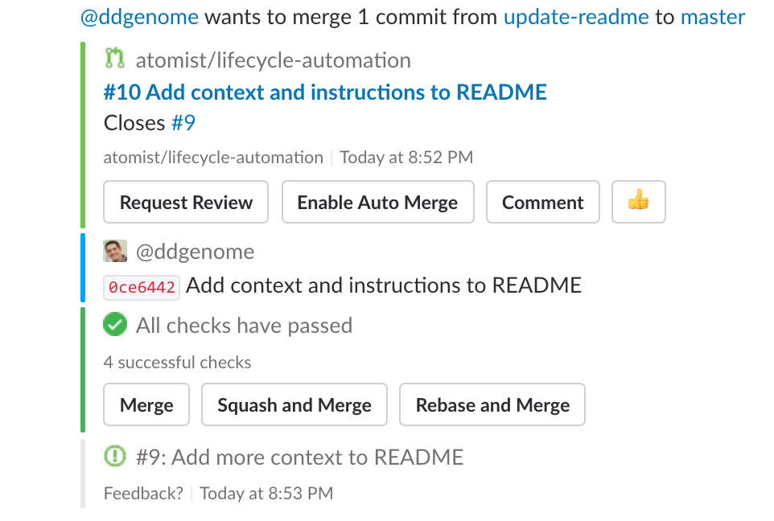

# @atomist/lifecycle-automation

[](https://travis-ci.org/atomist/lifecycle-automation)

This project contains lifecycle automations that create beautiful,
correlated, and actionable [Slack][slack] messages for issues,
pull requests, pushes, builds, and deployments using
the [`@atomist/automation-client`][client] node module to implement a
client that connects to the [Atomist][atomist] API.

<p align="center">
  
</p>

[slack]: https://slack.com (Slack)
[client]: https://github.com/atomist/automation-client-ts (@atomist/automation-client Node Module)

This Atomist API client is running at https://lifecycle.atomist.io and
can provide your team with better Slack messages about what is
happening in your development and delivery lifecycle by
simply adding the Atomist Bot to your Slack team:

<p align="center">
 <a href="https://atm.st/2wiDlUe">
  
 </a>
</p>

Once the Atomist Bot is in your Slack team, invite it to a channel
where you discuss a repository and link the channel to the repository
using the `repo` command

```
/invite @atomist
@atomist repo ORG REPO
```

replacing `ORG` with your GitHub.com organization and `REPO` with the
name of the repo you want to link.  Simply repeat for all the repos
and channels you want to link!

## Support

General support questions should be discussed in the `#support`
channel on our community Slack team
at [atomist-community.slack.com][slack].

If you find a problem, please create an [issue][].

[issue]: https://github.com/atomist/lifecycle-automation/issues

## Contributing

If you are interested in contributing to the Atomist open source
projects, please see our [contributing guidelines][contrib] and
our [code of conduct][code].

[contrib]: https://github.com/atomist/welcome/blob/master/CONTRIBUTING.md
[code]: https://github.com/atomist/welcome/blob/master/CODE_OF_CONDUCT.md

## Development

You will need to have [Node.js][node] installed.  To verify that the
right versions are installed, please run:

```
$ node -v
v8.4.0
$ npm -v
5.4.1
```

[node]: https://nodejs.org/ (Node.js)

### Build and Test

Command | Reason
------- | ------
`npm install` | to install all the required packages
`npm run build` | lint, compile, and test
`npm start` | to start the Atomist automation client
`npm run autostart` | run the client, refreshing when files change
`npm run lint` | to run tslint against the TypeScript
`npm run compile` | to compile all TypeScript into JavaScript
`npm test` | to run tests and ensure everything is working
`npm run autotest` | run tests continuously
`npm run clean` | remove stray compiled JavaScript files and build directory

### Release

To create a new release of the project, simply push a tag of the form
`M.N.P` where `M`, `N`, and `P` are integers that form the next
appropriate [semantic version][semver] for release.  The version in
the package.json is replaced by the build and is totally ignored!  For
example:

[semver]: http://semver.org

```
$ git tag -a 1.2.3
$ git push --tags
```

The Travis CI build (see badge at the top of this page) will publish
the NPM module and automatically create a GitHub release using the tag
name for the release and the comment provided on the annotated tag as
the contents of the release notes.

---

Created by [Atomist][atomist].
Need Help?  [Join our Slack team][slack].

[atomist]: https://www.atomist.com/
[slack]: https://join.atomist.com
